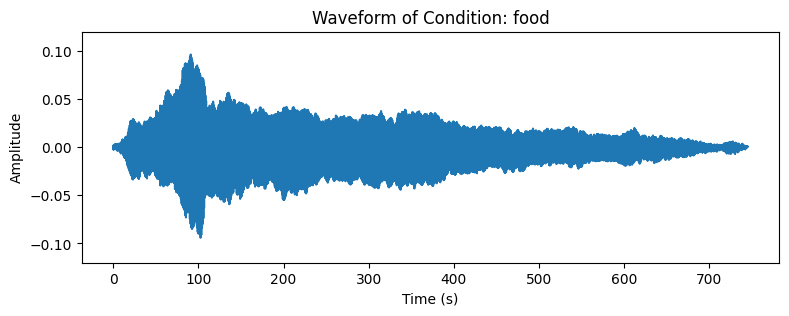
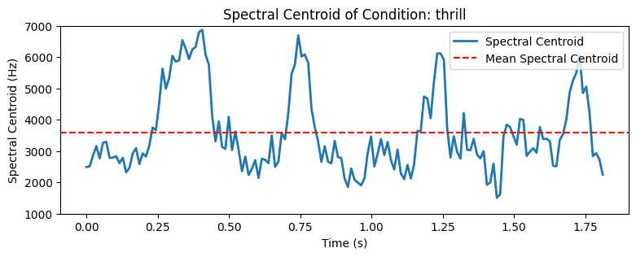
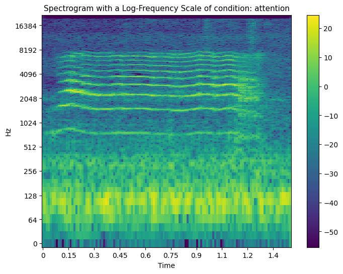
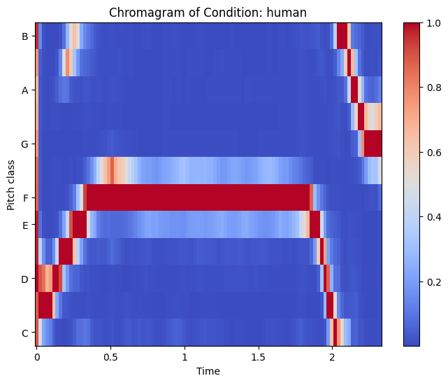
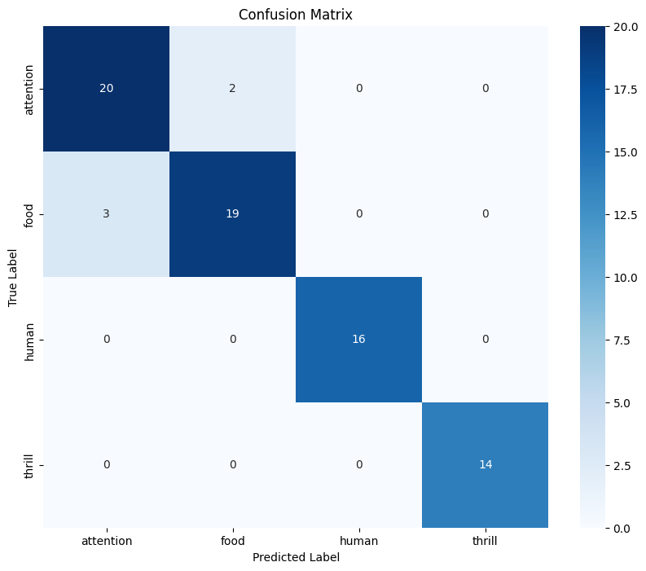

    

# FatKat: Deciphering Kitten's Meows with Neural Network-Based Audio Classification

Author: [Andrei Hushcha](https://www.linkedin.com/in/andrew-hushcha/)

## Overview
We aim to classify and understand kitten meows using advanced machine learning.  
This project focuses on revealing the complex acoustic patterns in kitten sounds using neural network model.  
Project's goal is to translate these vocalizations into clear data, enhancing our understanding of feline-human communication through deep learning techniques.

## Business Problem
Many people decide to get a kitten, but they don't always fully understand what these cute creatures need.  
Games, food or something else?  
And how to find out if they enjoy playing?

This project consists of two key parts:
- **Model for predicting meowing categories:**  
We aim to create a model that accurately determines which category a meow belongs to with the best accuracy score.  
- **Mobile app for owner training:**  
Based on the model's results, we are developing a mobile app.  

## Data Understanding
1. **Building the Dataset**  

_1.1 Participants:_  
- Mio: A 3.5-month-old Scottish Fold male kitten  
- A group of humans including the study author and his daughter Kate  

_1.2 Experimental Contexts:_  
- `F` (Food): Kitten recorded before mealtime
- `A` (Attention): Kitten recorded meowing in an isolated room
- `T` (Thrill): Kitten recorded while being petted
- `KAT` (Human): Human participant randomly mimicking meows

2. **Data Acquisition Process**  

The experiment spanned 15 days.  
Recordings were made using a Samsung Note20 equipped with the "Samsung Voice Recorder" app.  
Files were converted to .wav format and broken down into samples under 3 seconds.

3. **Dataset Composition:**  

The dataset consists of:
- 95 samples in `F`
- 95 samples in `A`
- 80 samples in `T`
- 98 samples in `KAT`  
Total: 368 audio files
Each sample is named in a format indicating the date, time, condition, and sample number.

3. **Prediction audio samples:**  

4 random samples from each condition, not included in dataset, and 1 extra by the author were chosen for prediction testing.

## Methods
This project uses Dummy, XGBoost, Neural Network Sequential Models.  
Findings are informed by a strong understanding of Librosa, Tensorflow, Keras, Scikit Learn.

## Results
Neural Network Sequential tuned with Keras Tuner exhibited the highest accuracy on both the training and test datasets, with scores of 95.9% and 93.2%, respectively.  
In the final prediction phase, all files were predicted correctly, demonstrating the effectiveness of the model in classifying audio samples based on the features extracted.  

## Exploratory Data Analysis
Audio files share common properties:  
- .wav format
- mono channel
- sample rate of 44100 Hz
- 16-bit depth  
The audio data is stored in NumPy arrays.  

The files were explored with diverse audio characteristics which offered various measures such as:  
- Waveform
- Spectral centroid
- Spectral bandwidth
- Spectral rolloff
- Zero-crossing value
- MFCC
- Spectrogram
- Chromagram

    

    

    

    

Each condition can be described as below: 
- `Food` showed fluctuating intensity and low-frequency dominance
- `Attention` was marked by consistent high-frequency sounds
- `Thrill` exhibited complex, variable sounds across a wide frequency range
- `Human` demonstrated stable, monotone audio with a focus on lower frequencies

## Dataset Processing  
The processed audio files were converted into spectrograms.  
The following features were extracted:
- Chroma Frequencies
- Spectral Centroid
- Spectral Bandwidth
- Spectral Rolloff
- Zero Crossing Rate
- MFCC, limited to 13 to prevent overfitting.  
## Modeling
Three models were created and trained: Dummy, XGBoost, and Neural Network Sequential.  
The XGBoost and Neural Network Sequential were fine-tuned using GridSearchCV and Keras Tuner, respectively.     

The Confusion Matrix reveals a certain level of misclassification between the _Food_ and _Attention_.

    

## Predictions
We used saved Neural Network Sequential model to predict the categories of random audio samples.  

A sample of a prediction:  
File: 202312090945_F_predict.WAV  
Probabilities for each condition:  
attention: 3.65%  
food: 96.35%  
human: 0.00%  
thrill: 0.00%  
Predicted condition: ['food']

## Data Limitations
- Data is limited to a specific age, gender, and breed of the cat
- Constraints extend to the specific environment and the kitten's behavioral range

# Conclusion
Overall, the project successfully utilized various audio analysis techniques and machine learning models to distinguish between different audio conditions.  
Tuned Neural Network Sequential model is considered the most effective for predictions.  
The high accuracy in model predictions highlights the potential of machine learning in sophisticated audio analysis tasks.

## Next Steps  

- **Mobile App Development:** based on our model's results we aim at helping new pet owners understand their pets from the start
- **Database Expansion:** we plan to enlarge our meow database, enhancing the accuracy and reliability of our predictions

## Appendix
The complete analysis can be found in the <a href="notebook.ipynb">Jupyter Notebook</a> and in the <a href="presentation.pdf">Presentation</a>.

For general questions, please contact Andrei Hushcha at <a href="mailto:andrew.hushcha@gmail.com">andrew.hushcha@gmail</a>.

## Sources
The database is owned by the author and is intended solely for academic use.  
When utilizing the database, proper attribution with a link to the author's [GitHub](https://github.com/andreihushcha/) is required.  
For commercial inquiries or usage, please contact the author directly.

## Repository Structure
├── dataset                         <- Folder containing audio files 
├── images                          <- Folder containing images used               
├── img_data                      <- Folder containing images extracted from audio dataset 
├── keras_tuner/hparam_tuning     <- Folder containing hyperpameters tuning results 
├── model                         <- Folder containing the best model 
├── predict                       <- Folder containing files used for predictions 
├── .gitignore                    <- gitignore file 
├── README.md                     <- The top-level README for reviewers of the project 
├── dataset.csv                   <- File containing extracted features from audio dataset 
├── notebook.ipynb                <- Narrative documentation of analysis in jupyter notebook 
└── presentation.pdf              <- PDF version of project presentation 

